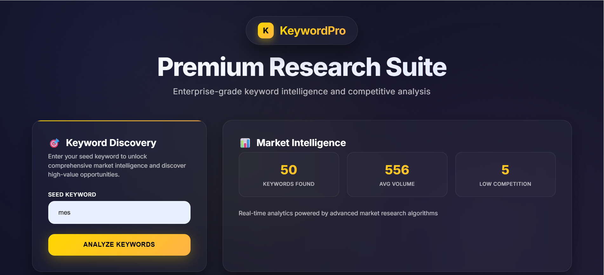

# 🔍 SEO Keyword Research AI Agent

This project is an AI-powered SEO keyword research agent that takes a **single seed keyword** and generates **50 SEO-friendly keyword suggestions** with **high monthly searches** and **low competition**, helping marketers and content creators dominate Google Search results.

## 🌐 Live Demo
Try it here 👉 [Live App](https://sinanpathiyil.app.n8n.cloud/webhook-test/seed%20keyword)

## 🧠 How It Works

1. **Frontend Input (HTML)**  
   A beautiful, responsive UI allows users to enter a seed keyword.

2. **AI Keyword Generation (Groq LLaMA3)**  
   A Groq-hosted LLaMA3 model generates raw keyword suggestions via the n8n HTTP node.

3. **SEO Data Fetch (RapidAPI)**  
   Each keyword is validated via [SEO Keyword Research API]([https://rapidapi.com/data-buyer/api/seo-keyword-research-api/](https://rapidapi.com/chandrVB/api/seo-keyword-research-api/playground/apiendpoint_d99143f6-0625-41d2-953a-fa784ce52895)) to fetch:
   - Monthly search volume
   - Competition index

4. **Filtering + Sorting Logic**  
   Keywords are filtered to exclude low-volume and high-competition ones, then sorted using:
   - Ascending: competition
   - Descending: search volume

5. **Final Output**  
   Top 50 keywords are returned and dynamically displayed in a table.

---

## 🛠 Tech Stack

| Component       | Tool / Tech                                 |
|-----------------|----------------------------------------------|
| Backend Flow    | n8n Workflow Automation                      |
| LLM Agent       | LLaMA3-70B hosted on Groq API                |
| SEO Data        | SEO Keyword Research API (RapidAPI)          |
| Frontend        | Custom HTML + CSS (Premium UI)               |

---

## ⚙️ How to Run Locally

1. Clone this repo
2. Import the `.json` n8n workflow file
3. Update the following API keys:
   - `Groq API Key`
   - `RapidAPI Key`
4. Host the HTML UI or open it locally in a browser
5. Ensure webhook endpoint matches your n8n instance

---

## 📁 Files Included

- `SEO Keyword Researcher Agent.json`: Complete n8n workflow
- `input.html`: Frontend UI
- `Development Plan.pdf`: Design rationale
- `assets/` : sample results

---

## 🖼️ Sample Output

Here’s an example of the ranked SEO keyword table returned by the agent:

---

## 📹 Video Demo

🎥 [Link to video presentation] — includes step-by-step narration & working example.

---

## 🤖 AI Agent Logic Summary

- Prompts LLM: "Suggest 50 SEO keywords for 'keyword'"
- Validates all with real data
- Sorts based on best SEO opportunity
- Returns clean JSON output or renders HTML table

---

## 📩 Contact

Feel free to reach out if you have questions or need customization.

---

### ⭐ If you find this project helpful, give it a ⭐!
